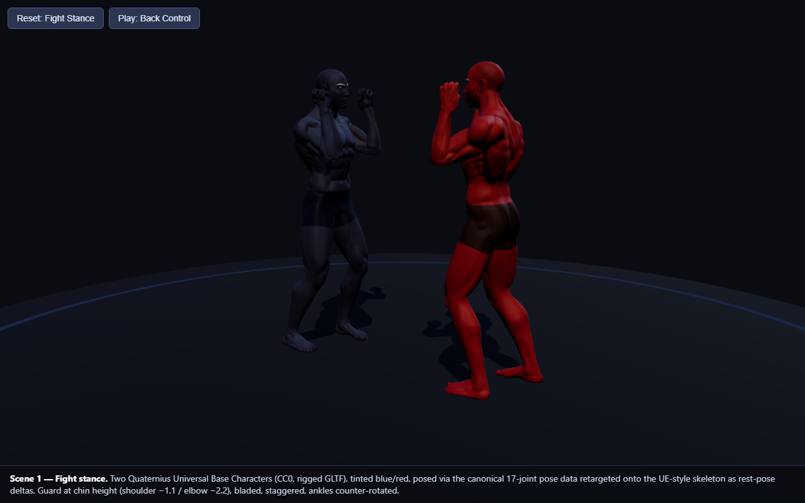

# demo-v2 — professional 3D character track, proof-of-concept

**What this proves (executed-level verification):** the `humanoid-fight-3d` skill's Track A
(rigged-GLB professional characters) works end-to-end in this environment — a real CC0 rigged
character loads in three.js, two independently-tinted instances pose from the canonical
17-joint pose data, two-body grappling contact is achievable and verifiable, and the whole
thing renders headlessly for screenshot audits. Every claim below was rendered and looked at
(screenshots in `shots/`), and contacts were probed numerically (`?dump`), not eyeballed.



## Asset

**Quaternius — Universal Base Characters** (Standard/free pack), `Superhero_Male_FullBody`
glTF + bin + textures, in `assets/`.

- Source: https://quaternius.com/packs/universalbasecharacters.html (download fulfilled via
  the itch.io mirror, quaternius.itch.io/universal-base-characters)
- License: **CC0 1.0 Universal** (public domain — free for any use, no attribution required);
  the pack's own `assets/License_Standard.txt` is kept alongside the model.
- The full zip is 122 MB; only the one needed model (~15 MB with textures) was extracted by
  ranged HTTP download of individual zip members (`tools/itch-zip-fetch.mjs`) — the rest of
  the pack was never downloaded.
- Two texture references were trimmed from the .gltf (hair normal map, body roughness map)
  to keep load/decode fast; visual impact at this scale is nil (the body normal map — the one
  that matters for muscle definition — is kept).

three.js 0.160 is vendored in `vendor/` (mirror of the unpkg CDN files) so the demo runs
offline / on slow internet.

## Run

```
node serve.mjs        # http://localhost:8077/demo.html  (file:// won't load the textures)
```

- Default scene: both fighters in the verified **fight stance** (chin-height guard
  −1.1/−2.2, bladed, staggered, ankle counter-rotation), facing each other, fists curled.
- **Play: Back Control** button: 1.2 s eased quaternion-slerp tween into the seated
  **back-control / rear-naked-choke** position (attacker behind, chest to back, right
  forearm wrapping the neck/upper chest, left arm over the shoulder, leg hooks inside).
- URL modes:
  - `?lab` — front/side/top simultaneous views (the Pose Lab audit harness)
  - `?pose=rnc` — start directly in the back-control end pose
  - `?pose=rest` / `?pose=arms` — retarget-debug poses
  - `?scrub=0.5` — freeze the stance→back-control tween at t (verifies the Play path)
  - `?bright` — lift ambient for screenshot auditing; `?dump` — POST joint world positions
    to the server log (contact checklist probing); `?shot` — pin Chromium virtual time for
    headless screenshots; `?fist=x:1` — finger-curl axis probe
- Headless screenshots: `tools\shot.ps1 -Url <url> -Out <png>` (handles the virtual-time
  race and per-run Edge profiles).

## How the retargeting works (and what needed correcting)

The model is **not** Mixamo-named — it uses UE-mannequin-style bones (`pelvis`,
`spine_01..03`, `upperarm_l`, `calf_r`, …), so the skill's `BONE_MAP` was re-targeted to
those names (suffix matching kept). Rest-pose quaternions are captured after load and every
canonical pose is applied as a **rest-pose delta**: the bone is driven to
`W_canonical(joint) * ALIGN(joint) * restWorldQ(bone)` — i.e. the canonical world-space
rotation composed exactly like the capsule rig (parent-chain of Euler quats), conjugated
onto the bone's captured rest orientation. Doing the delta in **character space** (rather
than raw bone-local space) is what makes per-bone local-frame weirdness of UE rigs a
non-issue.

Correction map findings on this rig:
- **T-pose vs canonical arms-down rest**: the arm chains need a ∓90° pre-roll about Z
  (`ALIGN` in demo.html). With that one correction, all 17 canonical joints' axes worked
  with NO per-joint sign flips (verified via `?pose=rest` / `?pose=arms` screenshots and
  `?dump` joint-position probes).
- **Finger curl** (bonus — the rig has full finger bones): local **+X**, sign flipped for
  the right hand. Probed empirically with `?fist=x:1|y:1|z:1`.
- **Tinting**: the skill's default blue `0x4fc3f7` renders *green* over this model's brown
  basecolor texture (tint multiplies the map) — use a low-green blue (`0x5580ff`).
  Materials are cloned per instance (never shared); instances are made with
  `SkeletonUtils.clone` (never naive `.clone`).

The back-control wrap arms were not hand-guessed: `tools/solve-rnc-arms.mjs` runs a
two-bone IK solve in canonical pose space against the opponent's actual probed neck
anchors (<2 cm wrist miss), and the solved Eulers are baked into the pose data — the
skill's "IK is an authoring tool, poses stay plain data" workflow.

## Screenshots (`shots/`)

| file | shows |
|---|---|
| `stance.png` | fight stance, hero angle, 4-light dojo scene |
| `rnc.png` | back control end pose, bodies in contact |
| `lab.png` | back control in `?lab` front/side/top audit view |
| `tween-mid.png` | the Play tween frozen at t=0.5 (no exploded limbs mid-path) |

## Honest gaps

- The choking forearm lands on the **upper chest/clavicle** line rather than tight under
  the chin — it reads as the seat-belt/neck wrap of back control, but a strict RNC finish
  would need the forearm ~10 cm higher and finger-level contact with the neck.
- The stance→back-control transition is a single 1.2 s tween between two keyposes, not a
  multi-beat technique (no penetration step / drag sequence); the opponent rotates 180°
  through the slerp path, which is geometrically clean but not how a human turns.
- Red's heels still sink ~2–4 cm into the mat in the seated pose (foot mesh hides it).
- No idle/breathing layer on held poses, and hair/eyebrow meshes are tinted with the body
  (one material covers them on this model — acceptable for team identity, not for a hero
  character).
